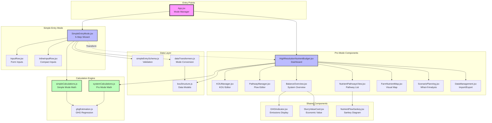
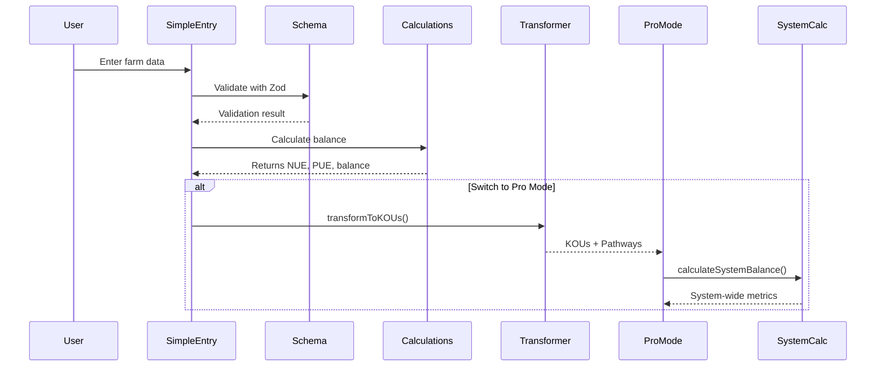
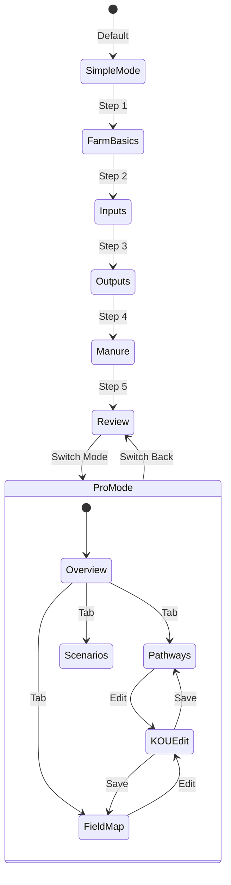
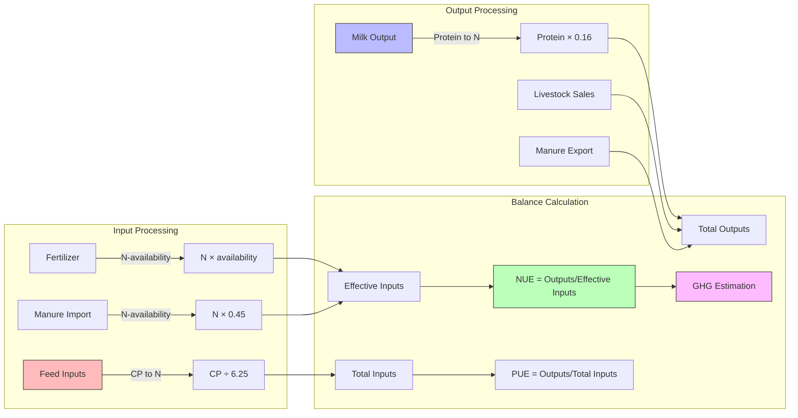
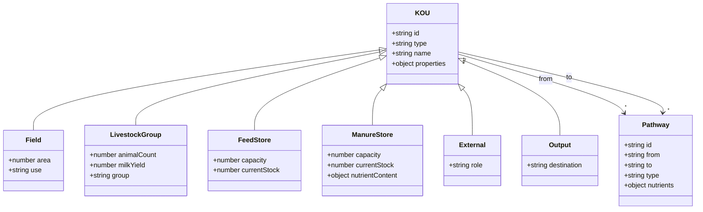
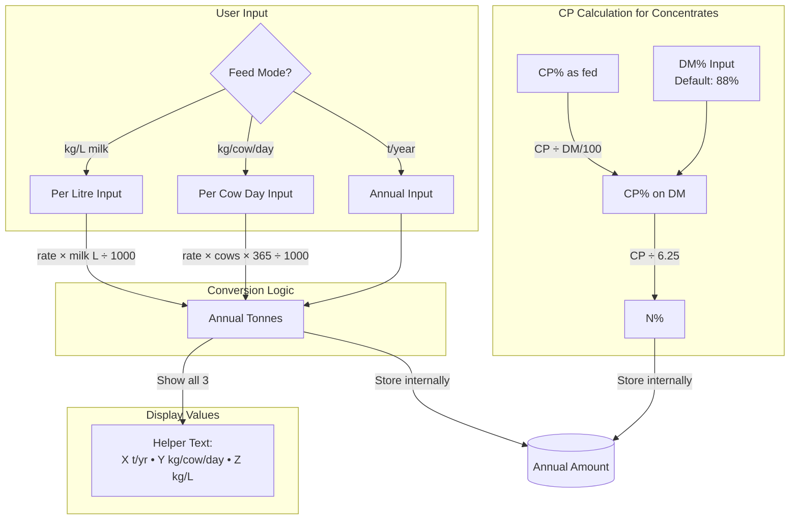
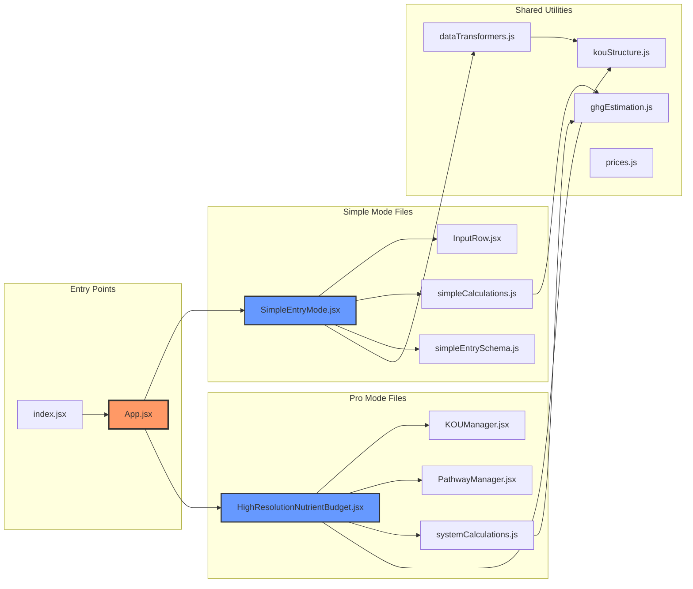

# Nutrient Data Management System - Architecture Diagrams

## Component Hierarchy & Data Flow

## Data Flow Sequence

## State Management Flow

## Nutrient Calculation Pipeline

## KOU (Key Operational Unit) Structure

## Feed Rate Calculation Flow

## File Relationships

## Save to view in any Mermaid viewer or GitHub README