# Nutrient Data Tool - Mental Models & User Guide

## Core Mental Model: The Farm as a System

```mermaid
graph TB
    subgraph "External Inputs"
        FEED[🌾 Purchased Feed]
        FERT[🧪 Fertilizers]
        IMPORT[🚚 Imported Slurry]
    end
    
    subgraph "The Farm System"
        FIELD[🌱 Fields/Crops]
        COWS[🐄 Livestock]
        STORE[🏪 Feed Store]
        SLURRY[💩 Slurry Store]
        
        FIELD -->|Homegrown Feed| STORE
        STORE -->|Daily Rations| COWS
        COWS -->|Manure| SLURRY
        SLURRY -->|Spreading| FIELD
        FERT -->|Application| FIELD
    end
    
    subgraph "Farm Outputs"
        MILK[🥛 Milk Sales]
        MEAT[🥩 Livestock Sales]
        EXPORT[🚛 Exported Slurry]
        LOSS[💨 Environmental Losses]
    end
    
    FEED --> STORE
    IMPORT --> SLURRY
    COWS --> MILK
    COWS --> MEAT
    SLURRY --> EXPORT
    FIELD --> LOSS
    SLURRY --> LOSS
    
    style COWS fill:#f9f,stroke:#333,stroke-width:3px
    style FIELD fill:#9f9,stroke:#333,stroke-width:3px
```

## User Personas & Their Mental Models

### 1. The Practical Farmer 👨‍🌾

**Mental Model**: "I put stuff in, I get milk out. How efficient am I?"
- Thinks in **physical quantities** (tonnes of feed, litres of milk)
- Wants **simple compliance** (am I under 170 kg N/ha?)
- Values **practical metrics** (feed per litre, cost per cow)

### 2. The Sustainability Consultant 📊

**Mental Model**: "How does this farm compare to best practice?"
- Thinks in **efficiency ratios** (NUE, PUE)
- Wants **benchmarking data** (top 25% achieve X)
- Values **environmental metrics** (GHG/litre, N surplus/ha)

### 3. The Veterinary Nutritionist 🔬

**Mental Model**: "Optimize nutrition for production while minimizing waste"
- Thinks in **nutritional terms** (CP%, DM%, ME)
- Wants **feed efficiency** (kg milk per kg concentrate)
- Values **precision** (exact protein needed, no excess)

## Workflow Mental Models

### Simple Entry Mode: The 5-Step Journey

**Mental Model**: "Tell my story step by step"
1. **Identity**: Farm size, cow numbers
2. **Inputs**: Everything I buy/use
3. **Outputs**: What I sell
4. **Cycling**: Internal nutrient flows
5. **Performance**: How efficient am I?

### Pro Mode: The System Builder

**Mental Model**: "Build accurate representation of my specific farm"
- Each **physical location** is a KOU
- Each **nutrient transfer** is a pathway
- Can model **complex scenarios** (what if I expand?)

## Conceptual Frameworks

### 1. The Efficiency Pyramid

```mermaid
graph TB
    subgraph "Hierarchy of Efficiency"
        A[NVZ Compliance<br/>≤170 kg N/ha<br/>⭐ Legal Requirement]
        B[Basic Efficiency<br/>NUE >25%<br/>⭐⭐ Industry Average]
        C[Good Efficiency<br/>NUE >35%<br/>⭐⭐⭐ Top Third]
        D[Excellence<br/>NUE >40%<br/>⭐⭐⭐⭐ Top 10%]
        
        A --> B
        B --> C
        C --> D
    end
    
    style A fill:#fbb,stroke:#333,stroke-width:2px
    style D fill:#9f9,stroke:#333,stroke-width:2px
```

### 2. The Value Framework

### 3. The Decision Flow

## Common Misconceptions vs Reality

## Getting Started Pathways

## The Continuous Improvement Cycle

```mermaid
graph LR
    subgraph "Annual Cycle"
        MEASURE[📊 Measure<br/>Current State] --> ANALYZE[🔍 Analyze<br/>Efficiency]
        ANALYZE --> PLAN[📋 Plan<br/>Improvements]
        PLAN --> IMPLEMENT[⚙️ Implement<br/>Changes]
        IMPLEMENT --> MONITOR[📈 Monitor<br/>Progress]
        MONITOR --> MEASURE
    end
    
    ANALYZE --> TOOL{Nutrient Tool}
    TOOL --> SIMPLE[Simple Mode<br/>Quick Assessment]
    TOOL --> PRO[Pro Mode<br/>Detailed Analysis]
    
    style TOOL fill:#bbf,stroke:#333,stroke-width:3px
```

## Key Takeaways

1. **Start Simple**: Use Simple Mode for quick insights
2. **Think Systems**: Nutrients flow in cycles, not straight lines
3. **Focus on Efficiency**: Better use of nutrients = better profits + environment
4. **Measure to Manage**: You can't improve what you don't measure
5. **Iterate**: Small improvements compound over time

This tool bridges the gap between:
- **What you do** (feed cows, spread fertilizer)
- **What happens** (nutrient flows, losses)
- **What it means** (efficiency, compliance, sustainability)